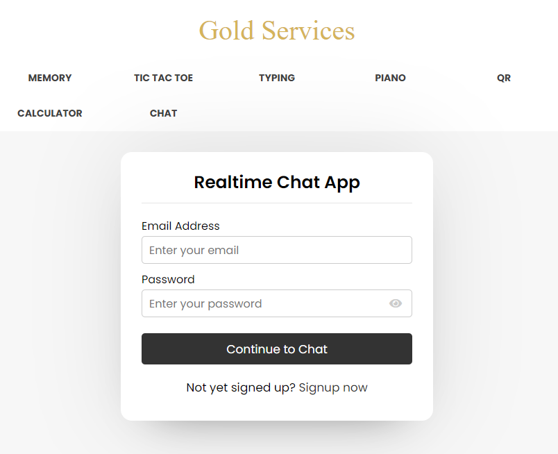

# Отчет по лабораторной работе №3 
## Изучение технологии AJAX

#### Цель работы:   
  
Разработать и реализовать анонимный чат с возможностью создания каналов. В интерфейсе отображается несколько каналов, пользователь может либо подключиться к существующему, либо создать новый. Сообщения доставляются пользователю без обновления страницы.

#### Пользовательский интерфейс:

- Форма входа

- Форма регистрации

- Форма зарегистрированного пользователя

- Форма чата


#### Пользовательские сценарии работы:

1. Пользователь вводит в адресной строке index.php и попадает на форму регистрации. После регистрации пользователь попадает на страницу с каналами.
2. Выбрав канал, пользователь попадает на страницу сhat.php с определенным пользователем. 
3. Дальше пользователь может написать и отправить его. Также виден статус пользователя.

#### API сервера и хореография:

Сервер работает с помощью GET-запросов, POST-запросов и AJAX-запросов.   
Также используются глобальные переменные, такие как $_SESSION[*name*] и другие. 

index.php, при отсутствии переменной $_SESSION['user'], перенаправляет пользователя на страницу auth.php. Если переменная есть, то перенаправление не происходит. При нажатии на кнопку Logout сервер отправляет запрос в logout.php (в результате запроса переменная $_SESSION['user']) будет уничтожена и направляет пользователя на auth.php.

Со страницы auth.php, при нажатии кнопки "Signup", сервер отправляет запрос на signup.php (тут данные будут проверены и, если всё ок, внесены в БД), передавая туда введённые в поля "First name", "Second name", "Email adress", "Password"  и "Image" данные. signup.php после обработки данных возвращает индикатор, в зависимости от значения которого будет выведено сообщение об ошибке или успешной регистрации.

При нажатии на странице auth.php кнопки "Login now", сервер направит на signin.php запрос с введёнными данными. signin.php проверяет данные на корректность и возвращает индикатор, в зависимости от значения которого будет выведено сообщение об ошибке или пользователь получит переменную $_SESSION['user']) и будет перенаправлен на index.php.

Со страницы index.php, при нажатии на пользователя которому ты хочешь написать сообщение, перенаправляет пользователя на страницу chat.php. chat.php отправляет запрос на добавление нового сообщения.

#### Структура базы данных:

Используются две таблицы:

### 1. Таблица messages

| msg_id | incoming_msg_id | outgoing_msg_id | msg |
| ------ | --------------- | --------------- | --- |

- **msg_id** : INT(11), PRIMARY KEY, AUTO_INCREMENT
(уникальный идентификатор сообщения)
- **incoming_msg_id**: int(255) (id получателя)
- **outgoing_msg_id**: int(255) (id отправителя)
- **msg**: VARCHAR(1000) (сообщение)


### 2. Таблица users

| user_id | unique_id | fname | lname | email | password | img | status |
| ------- | --------- | ----- | ----- | ----- | -------- | --- | ------ |

- **user_id** : INT(11), PRIMARY KEY, AUTO_INCREMENT
(уникальный идентификатор пользователя в базе данных)
- **unique_id**: VARCHAR(255) (уникальный идентификатор пользователя на сайте)
- **fname**: VARCHAR(255) (Имя)
- **lname**: VARCHAR(255) (Фамилия)
- **email**: VARCHAR(255) (Почта)
- **password**: VARCHAR(255) (Пароль)
- **img**: VARCHAR(255) (Фото)
- **status**: VARCHAR(255) (Статус активности)

#### Алгоритмы работы: 

- Алгоритм работы для форм signup.php и register.php 

### Программный код, реализующий систему

- **Вход в аккаунт**
```php
session_start();
    include_once "config.php";
    $email = mysqli_real_escape_string($conn, $_POST['email']);
    $password = mysqli_real_escape_string($conn, $_POST['password']);
    if(!empty($email) && !empty($password)){
        $sql = mysqli_query($conn, "SELECT * FROM users WHERE email = '{$email}'");
        if(mysqli_num_rows($sql) > 0){
            $row = mysqli_fetch_assoc($sql);
            $user_pass = md5($password);
            $enc_pass = $row['password'];
            if($user_pass === $enc_pass){
                $status = "Active now";
                $sql2 = mysqli_query($conn, "UPDATE users SET status = '{$status}' WHERE unique_id = {$row['unique_id']}");
                if($sql2){
                    $_SESSION['unique_id'] = $row['unique_id'];
                    echo "success";
                }else{
                    echo "Something went wrong. Please try again!";
                }
            }else{
                echo "Email or Password is Incorrect!";
            }
        }else{
            echo "$email - This email not Exist!";
        }
    }else{
        echo "All input fields are required!";
    }
```