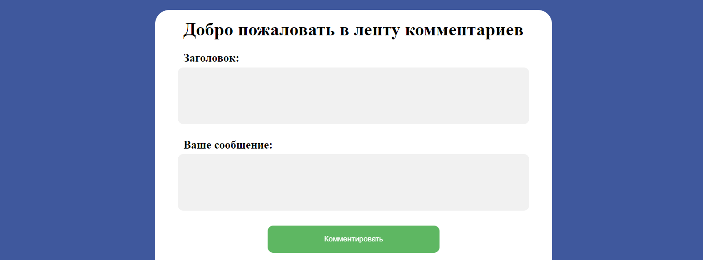
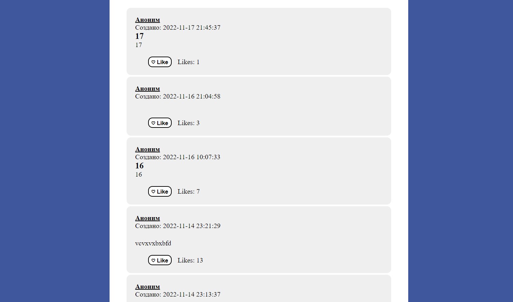

# HTTP аутентификация

## Цель работы:
Разработать и реализовать клиент-серверную информационную систему, реализующую механизм CRUD.

## Задание: 
- функциональность входа/выхода
- хранение паролей в хешированном виде
- форма регистрации

## Пользовательский интерфейс

Форма ввода комментариев
Комментарии пользователей


##  Пользовательский сценарий работы

#### API сервера и хореография
Сервер использует HTTP POST запросы с полями заголовка и текста комментария.

**Функция добавления комментариев на сайт:**
с помощью POST запроса отправляются такие данные как дата, заголовок и текс комментария.

**Функция вывода комментариев на сайте:**
из базы данных берётся только 100 последних комментариев (их дата добавления, заголовок и текст) и присваивает каждому имя пользователя "Аноним".

#### Пользовательский сценарий работы
При входе на страницу пользователь видит приветствие "Добро пожаловать в ленту комментариев" и форму для ввода комментария: поля заголовка и комментария.

## Структура базы данных
| id | title | message | data | likes |
| -- | ----- | ------- | ---- | ----- |
- **id** : INT(10), PRIMARY KEY, AUTO_INCREMENT
(уникальный идентификатор комментария)
- **title**: VARCHAR(1024), по умолчанию NULL
(Заголовок)
- **message**: TEXT, по умолчанию NULL
(Текст комментария)
- **date**: DATETIME, по умолчанию NULL (Дата и время создания записи)
- **likes**: INT(255) (Количество лайков на комментарии)

## Алгоритмы


## Программный код, реализующий систему

##### Код реализующий добавление комментария
```
function setComments($conn) {
    if(isset($_POST['commentSubmit'])) {
        $date = $_POST['date'];
        $title = $_POST['title'];
        $message = $_POST['message'];

        $sql = "INSERT INTO comments (date, title, message) VALUES ('$date', '$title', '$message')";
        $result = $conn->query($sql);
        unset($_POST['date']);
        unset($_POST['title']);
        unset($_POST['message']);
    }
}
```
##### Код реализующий вывод комментариев с лайками на сайт
```
function getComments($conn) {
    $sql = "SELECT DISTINCT* FROM comments ORDER BY date DESC LIMIT 100";
    $result = $conn->query($sql);
    while ($row = $result->fetch_assoc()) {
        echo "<div class='comment'>
            <br>
            <div class='name'> Аноним </div>
            ".$row['date']."<br>
            <div class='title'> ".$row['title']."<br> </div>
            ".$row['message']."
            <div><br><form method='POST' action='".likeSubmit($row)."'> <button type='submit' name='".$row['id']."' class='likebtn'>♡ Like</button>  Likes: ".$row["likes"]."</form></div>
            <br>
        </div>
        <br>";
    }
}

function likeSubmit($row) {    
    require("connection.php");
    if(isset($_POST[$row['id']])) {
        $id = $row['id'];
        $likes = $row['likes']+1;
        $query = "UPDATE comments SET likes = '$likes' WHERE id = '$id'";
        $result = mysqli_query($conn, $query);
        header('Location: main.php');
        exit;
    }
}
```
