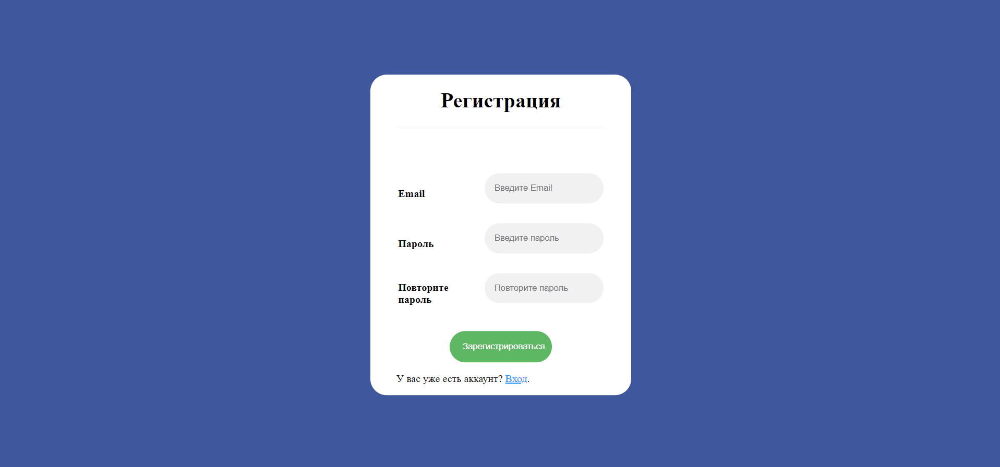
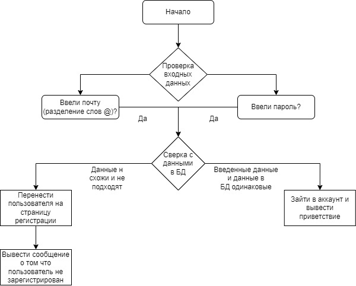
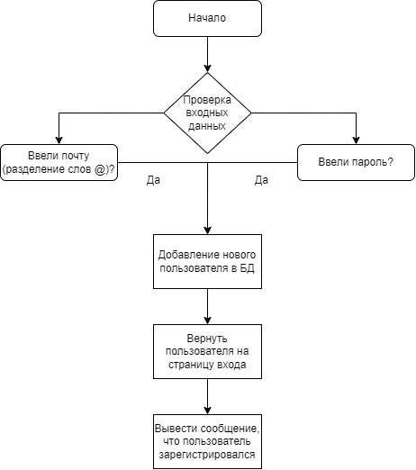

# HTTP аутентификация

## Цель работы:
Спроектировать и разработать систему авторизации пользователей на протоколе HTTP
### Пользовательский интерфейс
<<<<<<< HEAD
Регистрация
Вход
Аккаунт

#### Пользовательский сценарий работы

#### API сервера и хореография
=======

*Страница для регистрации*

*Страница для авторизации*

*Страница с аккаунтом пользователя*

#### Пользовательский сценарий работы
При входе на страницу пользователю предлагается зарегистрироваться (**Регистрация**), если этого не было сделано ранее. После регистрации пользователь может воспрользоваться страницея для входа (**Вход**), введя на неё почту(логин) и пароль. Если при входе в учётную запись логин и пароль были введены верно, пользователь получит доступ ко всем страницам сайта, требующим авторизации. В противном случае, он будет перенаправлен на входную страницу, где будет показано сообщение об ошибке.

#### API сервера
Сервер использует HTTP GET запросы с полями flag (отображение ошибок), email (передача почты(логина)) и password (передача пароля). Также, сервер использует куки email и token для работы с токеном авторизации.

####
>>>>>>> 8aff803666b7498682df2500d1bb88bfda67ba8c

#### Структура базы данных
| id | email | password |
| -- | ----- | -------- |
- id : INT(10), PRIMARY KEY, AUTO_INCREMENT
(уникальный идентификатор пользователя)
- email: VARCHAR(1024), по умолчанию NULL
(почта)
- password: VARCHAR(1024), по умолчанию NULL
(хешированный пароль)

#### Алгоритмы
Вход в аккаунт
Регистрация нового пользователя

#### Программный код, реализующий систему
