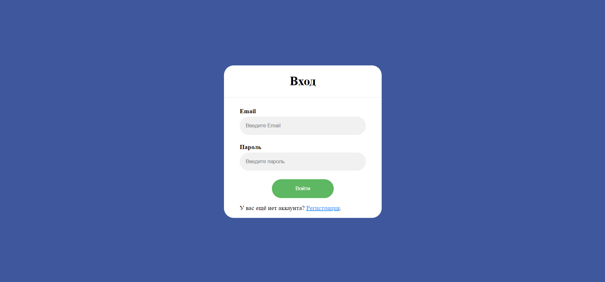
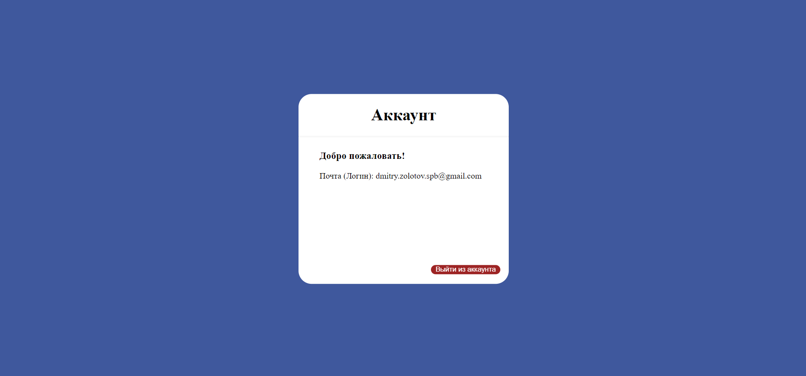

# HTTP аутентификация

## Цель работы:
Цель работы - спроектировать и разработать систему авторизации пользователей на протоколе HTTP. Выполненные требования:
- функциональность входа/выхода
- хранение паролей в хешированном виде
- форма регистрации

### Пользовательский интерфейс
Регистрация
Вход
Аккаунт

#### Пользовательский сценарий работы

#### API сервера и хореография
Сервер использует HTTP GET запросы с полями email (логин/почта) и password (пароль). 

**Алгоритм входа на сайт:**
отправляется запрос, который возвращает данные о пользователе с отправленным логином, если данные найдены - пароль сверяется с захешированным из базы данных и совершается вход. В ином случае на экране пользователь видит сообщение "Неправильный логин или пароль!". Если данные о пользователе с данным логином не были найдены вообще - появляется текст "Данный пользователь не зарегистрирован!".

**Алгоритм регистрации на сайте:**
принимаются все введённые пользователем данные, а также генерируются хеш пароля. Если пользователь оставил одно из полей логин/пароль пустым, появляется сообщение "Вы не ввели логин или пароль!". Серверу отправляется запрос и пользователь заносится в базу данных, после чего попадает на страницу входа. Если пользователь с этим логином в базе данных есть - выскакивает сообщение "Username already taken!" - имя пользователя уже занято.

**Функция аутентификации пользователя:**
по запросу серверу возвращается токен аутентификации, соответствующий пользователю с токеном, используемым в браузере. Если совпадение найдено - переход на главную страницу разрешён, в ином случае пользователь возвращается на страницу входа для повторной авторизации.

#### Пользовательский сценарий работы
При входе на страницу пользователю предлагается зарегистрироваться (**Регистрация**), если этого не было сделано ранее. После регистрации пользователь может воспрользоваться страницея для входа (**Вход**), введя на неё почту(логин) и пароль. Если при входе в учётную запись логин и пароль были введены верно, пользователь получит доступ ко всем страницам сайта, требующим авторизации. В противном случае, он будет перенаправлен на входную страницу, где будет показано сообщение об ошибке.

#### API сервера
Сервер использует HTTP GET запросы с полями flag (отображение ошибок), email (передача почты(логина)) и password (передача пароля). Также, сервер использует куки email и token для работы с токеном авторизации.

#### Структура базы данных
| id | email | password |
| -- | ----- | -------- |
- id : INT(10), PRIMARY KEY, AUTO_INCREMENT
(уникальный идентификатор пользователя)
- email: VARCHAR(1024), по умолчанию NULL
(почта)
- password: VARCHAR(1024), по умолчанию NULL
(хешированный пароль)

#### Алгоритмы
Вход в аккаунт
Регистрация нового пользователя

#### Программный код, реализующий систему

##### Код реализации авторизации
```
if($row['password'] == '')
{
      echo 'Вы не зарегистрированы!';
}

if (!strcmp($row['password'], $password))
{
      mysqli_close($conn);
      header("Location: account.php", true, 303);
}
else
{
      $msg = 'Вы ввели неверный пароль!';
      setcookie("msg", $msg);
      mysqli_close($conn);
      // echo 'Вы ввели неверный пароль!';

      // sleep(5);

      header("Location: signin.php", true, 303);
}
```
##### Код реализации регистрации
```
if (!$conn)
{
      print('Connect not found!'.mysqli_error());
}

$email = $_POST['email'];
$password = md5($_POST['psw']);

$query = "INSERT INTO users (id, email, password) VALUES (NULL, '$email', '$password')";
$test = mysqli_query($conn, $query);
if($test == true)
{
      $msg = 'Вы успешно зарегистрировались!';
      setcookie("msg", $msg);
      mysqli_close($conn);
      header("Location: signin.php", true, 303);
}
else
{
      echo 'Проблема!!!!!!!!!!!';
}
```
