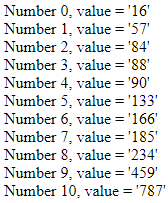
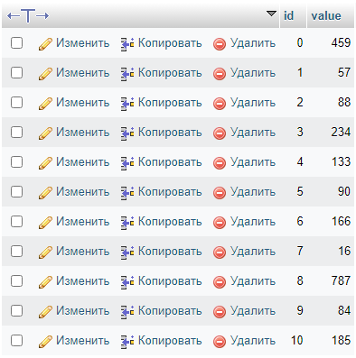
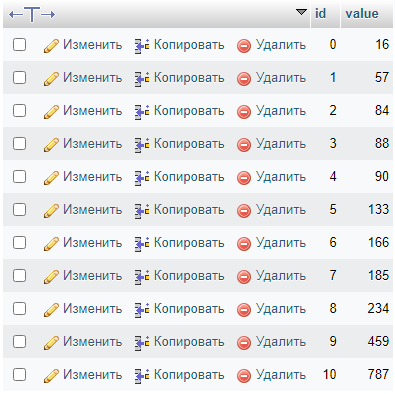

# Отчет по лабораторной работе №5
## Разработка сервисов

#### Цель работы:   
  
Разработать и реализовать алгоритм внешней сортировки. Данные хранятся на сервере в массиве, сервер предоставляет доступ к отдельным элементам. Клиент поочередно запрашивая отдельные ячейки сортирует массив.

#### Пользовательский интерфейс:

Отсортированный массив из базы данных

#### Структура базы данных:

| id | value | 
| -- | ----- |

- **id** : INT(11), PRIMARY KEY (идентификатор значения)
- **value**: int(255) (значение)

**База данных до сортировки**

**База данных после сортировки**

#### Алгоритмы работы: 

После ввода данных в базу данных, при перезагрузге страницы сайта они сортируются так как это указано в коде.

### Программный код, реализующий систему

- **Внесение данных в базу данных с помощью SQL**
```
INSERT INTO `sorting` (`id`, `value`) VALUES
(0, 459),
(1, 57),
(2, 88),
(3, 234),
(4, 133),
(5, 90),
(6, 166),
(7, 16),
(8, 787),
(9, 84),
(10, 185);
```

- **Сортировка пузырьком**
```php
function bubbleSort() {
    require("connection.php");
    $result = mysqli_query($con, "SELECT DISTINCT * FROM sorting"); 
    $size = mysqli_num_rows($result);
    for ($i=0; $i<$size; $i++) {
        for ($j=0; $j<$size-$i-1; $j++) {
            $k = $j+1;
            if (getValue($k) < getValue($j)) {
                $temp = getValue($k);
                setValue($k, getValue($j));
                setValue($j, $temp);
            }
        }
    }
    for ($i=0; $i<$size; $i++) {
        echo("Number $i, value = '".getValue($i)."'");
        echo "<br>";
    }
}
```