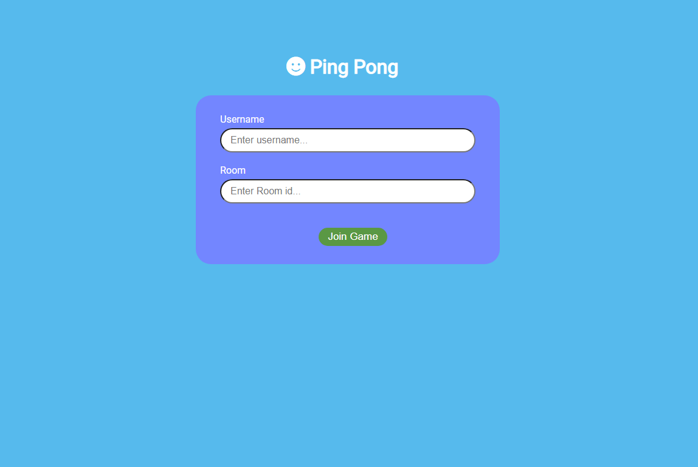
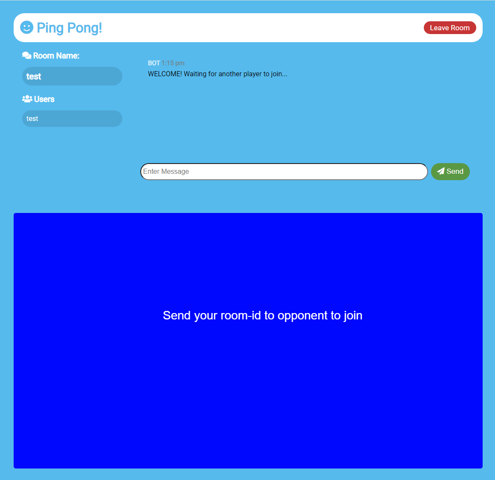
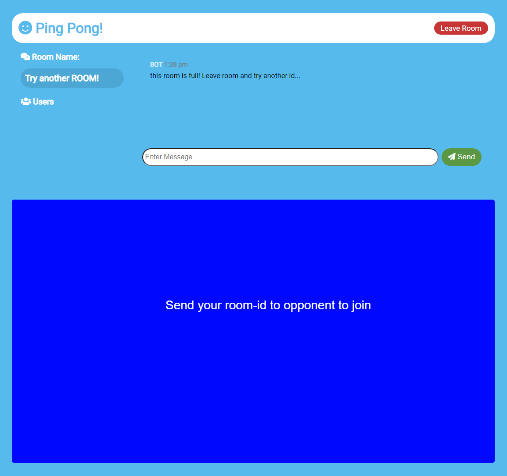
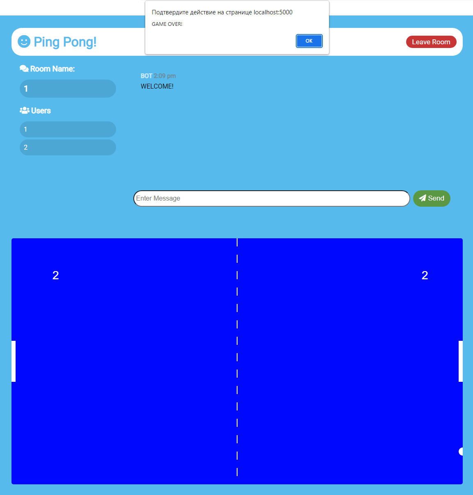

# Разработка приложения реального времени 

## Цель работы:
Разработать и реализовать игру пинг-понг. Хранение и обработка модели происходит на сервере. Общение сервера и клиентов происходит по websocket. Для отрисовки вида используется canvas. Игра завершается при достижении нужного счёта одним из игроков.

## Пользовательский интерфейс

Регистрация (вход) пользователя в игровую комнату

Комната с игрой, чатом, названием комнаты и списком игроков

##  Пользовательский сценарий работы

#### API сервера и хореография
Для реализации проекта используется canvas, websocket.
Для дизайна сайта использовался Cloudflare и шрифты Googleapis.

#### Пользовательский сценарий работы
При входе на страницу пользователь предоставляются окна для ввода Логина и Номера комнаты, чтобы начать играть.

Если номер комнаты не занят, то пользователь успешно в неё заходит. В противном случает, вместо номера комнаты появляется просьба попробовать ввести новый номер.

Сообщении о переполненной комнате и просьба использовать другой ID комнаты

## Алгоритмы

- **Начало игры**

Игра начнётся только в том случае, если в комнате есть два игрока. До начала игровое поле будет недоступно, ожидая второго игрока.

- **Алгоритм выигрыша**

Пользователь может ввести только заголовок и комментарий. Так как лента комментариев анонимная, то у всех пользователей автоматически добавляется имя: Аноним. Также каждому комментарию присваивается дата и время, когда он был отправлен.

После достижения, заданного в коде количества побед. Появляется окно с сообщением об окончании игры, после чего игроки могут заново зайти к комнату и начать играть с 0.

Конец игры!


- **Алгоритм игры**

Мяч появляется в центре игрового поля и летит в сторону одного из игроков. Игрок управляет своей стенкой с помощью курсора мыши, поднимая его вверх или опуская вниз.

## Программный код, реализующий систему

#### Реализация присоединения к комнате
```html
<div class="join-container">
		<header class="join-header">
		<h1><i class="fas fa-smile"></i> Ping Pong </h1>
		</header>
		<main class="join-main">
    		<form action="chat.html">
    				<div class="form-control">
    				<label for="username">Username</label>
    				<input
    						type="text"
    						name="username"
    						id="username"
    						placeholder="Enter username..."
    						required
    				/>
    				</div>
    				<div class="form-control">
    				<label for="room">Room</label>
    				<input
    						type="text"
    						name="room"
    						id="room"
    						placeholder="Enter Room id..."
    						required
    				/>
    				</div>
    				<button type="submit" class="btn">Join Game</button>
    		</form>
		</main>
</div>
```
###  Реализация проверки на победу
```js
function ballReset() {
    if (player1Score >= WINNING_SCORE ||
        player2Score >= WINNING_SCORE) {
        showingWinScreen = true;
        alert("GAME OVER!")
        window.location.href = 'index.html';
    }
    ballSpeedX = -ballSpeedX;
    ballX = canvas.width / 2;
    ballY = canvas.height / 2;
}
```

