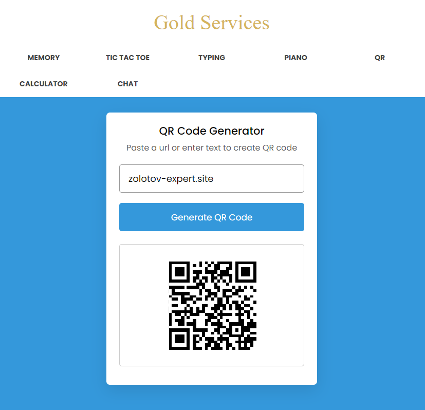
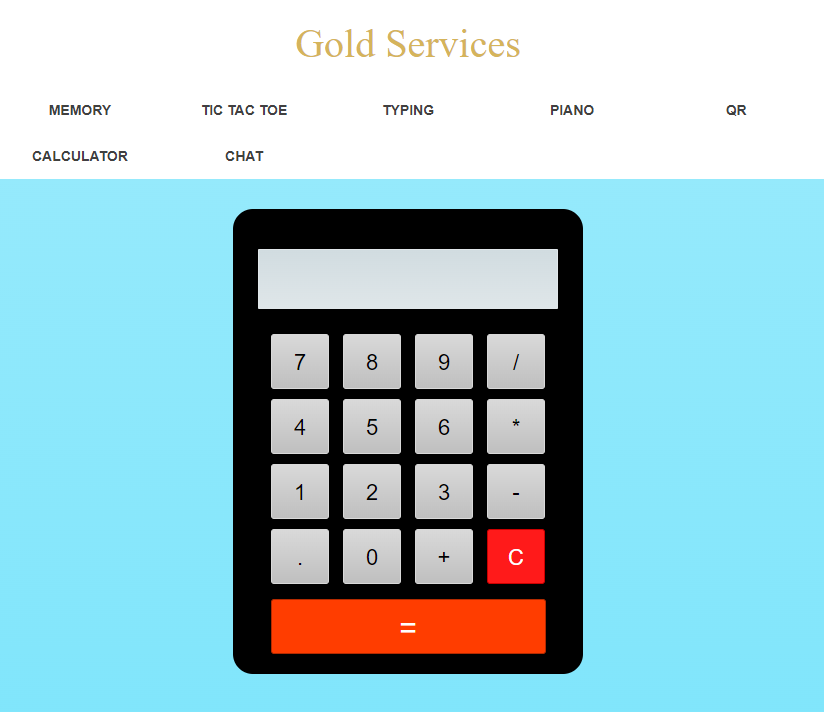

# Курсовая работа 

## Цель работы:
Разработать и реализовать полностью рабочий сайт на хостинге. Реализовать 

## Пользовательский интерфейс

Заходя на сайт пользователь может выбрать любую игру или сервис из верхнего меню.


## Сервисы и игры сайта [zolotov-expert.site](https://zolotov-expert.site):
- [Memory](###Memory)
- [Tic Tac Toe](###TicTacToe)
- [Typing](###Typing)
- [Piano](###Piano)
- [Memory](###Memory)
- [QR](###QR)
- [Calculator](###Calculator)
- [Chat](###Chat)


<!--   Memory   -->

## Memory

### Пользовательский сценарий работы

Игроку даётся 12 карточек и 30 сек на игру. Так же ведется подсчёт количества переворотов карточек. Когда пользователь перевернул все карточки, то таймер останавливается и активной остаётся только кнопка "Refresh", которая начинает игру заново. 

### Алгоритмы

- **Начало игры**

Игра начинается после первого же нажатия на одну из карточек. Начнётся работа таймера и подсчёта количества переворотов карточек.

- **Конца игры**

Игра заканчивается в двух случаях: если перевернуты все карточки и найдены пары или если закончился таймер.

- **Игра**

Игрок переворачивает по одной карточке, но максимальное количество перевернутых не превышают 2 штук. Если две карточки не совпадают рисунком, то они переворачиваются обратно и пользователь должен искать пару, которая совпадёт.

### Программный код, реализующий систему

- **Переворот карты**
```js
function flipCard({target: clickedCard}) {
    if(!isPlaying) {
        isPlaying = true;
        timer = setInterval(initTimer, 1000);
    }
    if(clickedCard !== cardOne && !disableDeck && timeLeft > 0) {
        flips++;
        flipsTag.innerText = flips;
        clickedCard.classList.add("flip");
        if(!cardOne) {
            return cardOne = clickedCard;
        }
        cardTwo = clickedCard;
        disableDeck = true;
        let cardOneImg = cardOne.querySelector(".back-view img").src,
        cardTwoImg = cardTwo.querySelector(".back-view img").src;
        matchCards(cardOneImg, cardTwoImg);
    }
}
```


<!--   Tic Tac Toe   -->

## Tic Tac Toe (Крестики-нолики)

### Пользовательский сценарий работы

Классическая игра в крестики-нолики, но только с ботом.

### Алгоритмы

- **Начало игры**

Пользователь должен выбрать одну из сторон: Крестик или Нолик. После чего откроется игровое поле 3х3 и начнётся игра.

- **Алгоритм конца игры**

Игра заканчивается в двух случаях: если победит одна из сторон или если произойдет ничья. После чего можно нажать на кнопку "Replay" и начать играть заново.

**Победа!**
**Ничья!**

- **Алгоритм игры**

Игроки по очереди выбирают клетку, в которую они поставят свой знак. Над игровым полем показывается, то кто сейчас ходит.

**Очередь О**
**Очередь Х**


<!--   Typing   -->

## Typing

Печать на русском языке
Печать на английском языке

После входа на страницу пользователю выводится один из 35-40 текстов. После начала печатанья 60-ти секундный таймер начинает отчёт времени. Если допускается ошибка, то ошибочная буква выделяется красным, но её можно заменить на правильную. Так же в нижнем меню программы есть счётчики: слов в минуту(WPM) и знаков в минуту(CPM).

Если не понравился текст, вы закончили печатать или закончился таймер, то можно нажать но кнопку "Try Again" и появится новый текст.

### Пользовательский сценарий работы

Классическая игра в крестики-нолики, но только с ботом.

### Алгоритмы

- **Начало игры**

После входа на страницу пользователю выводится один из 35-40 текстов. Пользователь может в любой момент начать печатать, после чего 60-ти секундный таймер начинает отчёт времени.

- **Алгоритм конца игры**

Игра заканчивается в двух случаях: если победит одна из сторон или если произойдет ничья. После чего можно нажать на кнопку "Replay" и начать играть заново.

**Победа!**
**Ничья!**

- **Алгоритм игры**

Игроки по очереди выбирают клетку, в которую они поставят свой знак. Над игровым полем показывается, то кто сейчас ходит.

**Очередь О**
**Очередь Х**


<!--   Piano   -->

## Piano (Игра на небольшом Пианино)

Клавиши с буквами на клавиатуре
Пианино без клавишных подсказок

У пользователя есть возможность управлять громкостью воспроизведения, включить подсказки, в виде букв на клавиатуре.


<!--   QR   -->

## QR


Пользователь сайта может перевести любой текст или ссылку в формат QR.

###  Пользовательский сценарий работы

Ему необходимо ввести желаемый текст в форму и нажать на кнопку “Generate QR Code”. После этого под кнопкой появится QR-код, который можно, будет сканировать или сохранить для дальнейшего использования.

### Программный код, реализующий систему

- **Кнопка генерации QR**
```js
generateBtn.addEventListener("click", () => {
    let qrValue = qrInput.value.trim();
    if(!qrValue || preValue === qrValue) return;
    preValue = qrValue;
    generateBtn.innerText = "Generating QR Code...";
    qrImg.src = `https://api.qrserver.com/v1/create-qr-code/?size=200x200&data=${qrValue}`;
    qrImg.addEventListener("load", () => {
        wrapper.classList.add("active");
        generateBtn.innerText = "Generate QR Code";
    });
});
```


<!-- Calculation -->

## Calculation

###   Пользовательский сценарий работы

Калькулятор может считать целые и десятичные числа используя примитивные математические символы, такие как: плюс, минус, умножение и деление.


<!-- Chat -->

## Chat

- **Регистрация**
- **Авторизация**
- **Список чатов**
- **Поиск пользователя**
- **Диалоговое окно**

###  Пользовательский сценарий работы

Веб чат имеет регистрацию, авторизацию и диалоги между пользователями.
Если пользователь «в сети», то в списке чатов, около него горит зеленые индикатор, в противном случает серый. Также в чате с пользователем, под его именем, написано активен ли пользователь.

## Структура базы данных

### 1. Таблица messages

| msg_id | incoming_msg_id | outgoing_msg_id | msg |
| ------ | --------------- | --------------- | --- |

- **msg_id** : INT(11), PRIMARY KEY, AUTO_INCREMENT
(уникальный идентификатор сообщения)
- **incoming_msg_id**: int(255) (id получателя)
- **outgoing_msg_id**: int(255) (id отправителя)
- **msg**: VARCHAR(1000) (сообщение)


### 2. Таблица users

| user_id | unique_id | fname | lname | email | password | img | status |
| ------- | --------- | ----- | ----- | ----- | -------- | --- | ------ |

- **user_id** : INT(11), PRIMARY KEY, AUTO_INCREMENT
(уникальный идентификатор пользователя в базе данных)
- **unique_id**: VARCHAR(255) (уникальный идентификатор пользователя на сайте)
- **fname**: VARCHAR(255) (Имя)
- **lname**: VARCHAR(255) (Фамилия)
- **email**: VARCHAR(255) (Почта)
- **password**: VARCHAR(255) (Пароль)
- **img**: VARCHAR(255) (Фото)
- **status**: VARCHAR(255) (Статус активности)

### Программный код, реализующий систему

- **Вход в аккаунт**
```php
session_start();
    include_once "config.php";
    $email = mysqli_real_escape_string($conn, $_POST['email']);
    $password = mysqli_real_escape_string($conn, $_POST['password']);
    if(!empty($email) && !empty($password)){
        $sql = mysqli_query($conn, "SELECT * FROM users WHERE email = '{$email}'");
        if(mysqli_num_rows($sql) > 0){
            $row = mysqli_fetch_assoc($sql);
            $user_pass = md5($password);
            $enc_pass = $row['password'];
            if($user_pass === $enc_pass){
                $status = "Active now";
                $sql2 = mysqli_query($conn, "UPDATE users SET status = '{$status}' WHERE unique_id = {$row['unique_id']}");
                if($sql2){
                    $_SESSION['unique_id'] = $row['unique_id'];
                    echo "success";
                }else{
                    echo "Something went wrong. Please try again!";
                }
            }else{
                echo "Email or Password is Incorrect!";
            }
        }else{
            echo "$email - This email not Exist!";
        }
    }else{
        echo "All input fields are required!";
    }
```


<!-- Общая информация по сайту -->

## Общая информация по сайту

#### API сервера и хореография

Для создания сайта были использованы:
- POST и GET запросы
- AJAX
- Cloudflare
- Google API
- QR API
